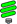

# Fluorescence Tracker App  

This app uses computer vision point tracking to quantify near infrared signals emitted by (ICG) Indocyanine Green during fluorescence angiography.  Short overview videos of how to use this app can be found in the ["How To" Video Series for Biomedical and Pharmaceutical Applications](https://www.mathworks.com/videos/series/how-to-video-series-for-biomedical-and-pharmaceutical-applications.html).

The following research in colorectal cancer was carried out using this software: 
* ["Digital dynamic discrimination of primary colorectal cancer using systemic indocyanine green with near-infrared endoscopy"](https://www.nature.com/articles/s41598-021-90089-7) by J. Dalli et al., Scientific Reports 11, Article 11349 (2021).
* ["Explainable endoscopic artificial intelligence method for real-time in situ significant rectal lesion characterization: a prospective cohort study"](https://journals.lww.com/international-journal-of-surgery/fulltext/2025/02000/explainable_endoscopic_artificial_intelligence.57.aspx) by N. Hardy et al., International Journal of Surgery 111(2):p 2313-2316 (2025).

This research is also highlighted in the following technical articles:
* ["Automating Endoscopic Tissue Characterization in Cancer Patients with Computer Vision"](https://www.mathworks.com/company/newsletters/articles/automating-endoscopic-tissue-characterization-in-cancer-patients-with-computer-vision.html)
* ["University College Dublin Researchers Harness Computer Vision and AI for Real-Time Biopsy-Free Cancer Discrimination"](https://www.mathworks.com/company/user_stories/advancing-real-time-cancer-diagnosis-with-ai.html)

## Requirements
* MATLAB&reg; R2022a (or newer)
* Image Processing Toolbox&trade;, Computer Vision Toolbox&trade;, and Statistics and Machine Learning Toolbox&trade;
* GPU Computing as shown in webinar requires Parallel Computing Toolbox&trade;
* Please see the [Fluorescence Tracker App User Guide](https://github.com/mathworks/Fluorescence-Tracker-App/blob/main/FluorescenceTrackerUserGuide.pdf) for video format requirements

## Getting Started &nbsp; 

Click the Fluorescence Tracker icon (green bulb) above to launch the app in MATLAB&reg; Online&trade;. This also installs the supporting functions/scripts and automatically opens the MATLAB Project.

*Otherwise* (and in general) from MATLAB, always start by double-clicking on `AnomalyClassification.prj` to open the [MATLAB Project](https://www.mathworks.com/help/matlab/projects.html). The app can then be run (or the scripts opened) using the "SHORTCUTS" on the "PROJECT" tab of the MATLAB toolstrip.

Please see the [Fluorescence Tracker App User Guide](https://github.com/mathworks/Fluorescence-Tracker-App/blob/main/FluorescenceTrackerUserGuide.pdf) for more information.

## Example Scripts
Also included are several example scripts that can be used independent of the Fluorescence Tracker app.

* ["How to Detect and Track Features in a Video with MATLAB"](https://www.mathworks.com/videos/how-to-detect-and-track-features-in-a-video-1648706043636.html)
  * `howto/FeatureTrackingUsingKLTExample.mlx`
* ["How to Register and Align Features in a Video with MATLAB"](https://www.mathworks.com/videos/how-to-register-and-align-features-in-a-video-with-matlab-1687170979668.html)
  * `howto/ImageRegistrationExample.mlx`
* ["How to Develop a Machine Learning Classifier with MATLAB"](https://www.mathworks.com/videos/how-to-develop-a-machine-learning-classifier-with-matlab-1687171767480.html)
  * `howto/FluorescenceClassification.mlx`
* ["Extracting Features and Classifying Anomalies using Computer Vision and Machine Learning"](https://www.mathworks.com/videos/extracting-features-and-classifying-anomalies-using-computer-vision-and-machine-learning-1714481441822.html)
  * `webinar/Part1_ExtractingFeatures.mlx`
  * `webinar/Part2_ClassifyingAnomalies.mlx`
  * `webinar/AnomalyClassifier.mlapp`

## References
* [Overview of MATLAB Apps](https://www.mathworks.com/help/matlab/creating_guis/apps-overview.html)
* [App Building with MATLAB](https://www.mathworks.com/help/matlab/gui-development.html)
* [Feature Detection and Extraction with MATLAB](https://www.mathworks.com/help/vision/feature-detection-and-extraction.html)
* [Tracking and Motion Estimation with MATLAB](https://www.mathworks.com/help/vision/tracking-and-motion-estimation.html)
* [Image Registration with MATLAB](https://www.mathworks.com/help/images/image-registration.html)
* [MATLAB for Machine Learning](https://www.mathworks.com/solutions/machine-learning.html)

_Copyright 2021-2024 The MathWorks, Inc._
